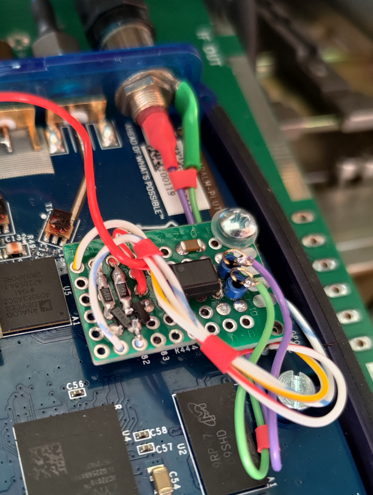
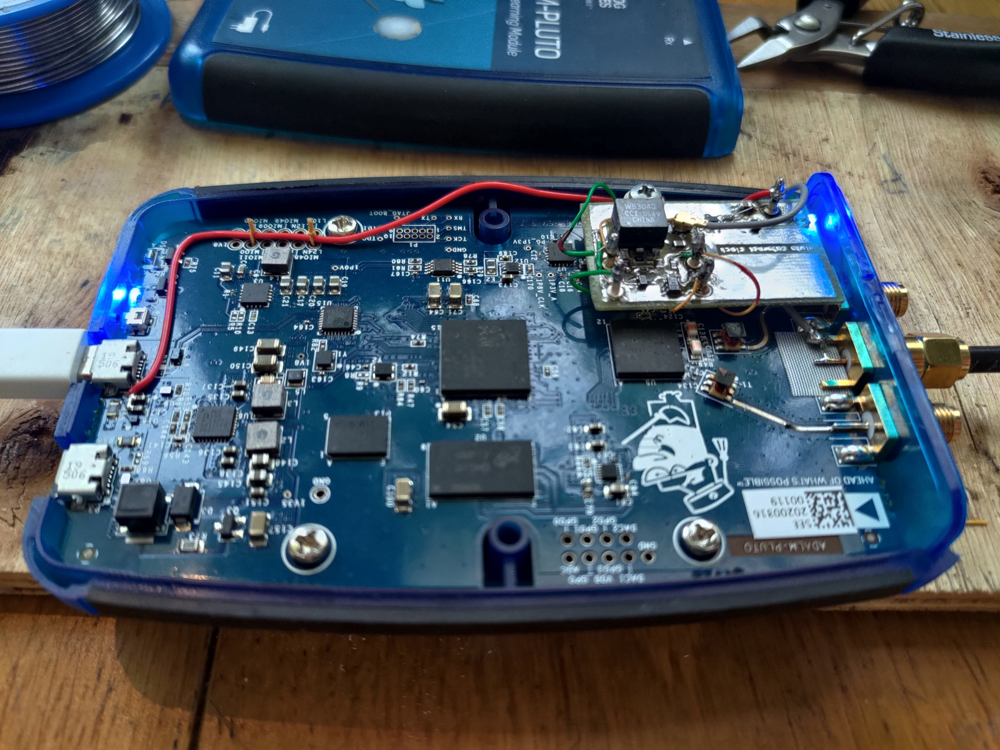
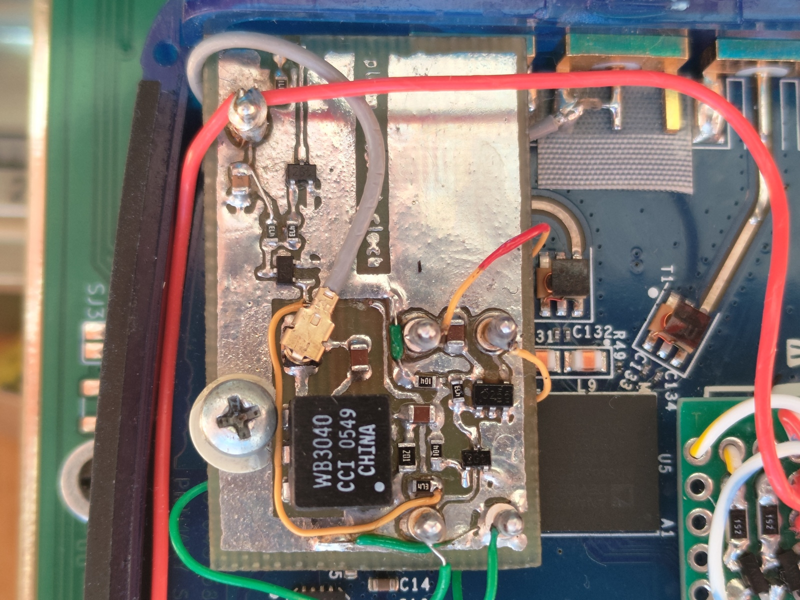
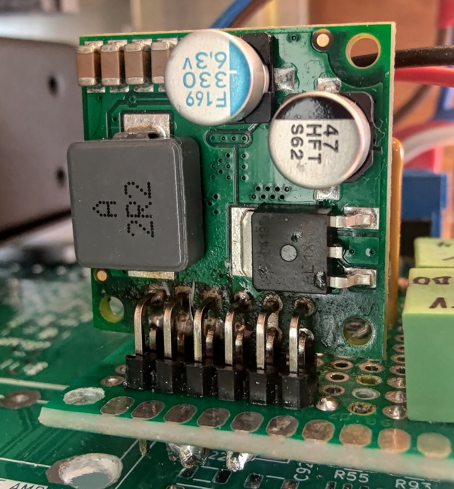
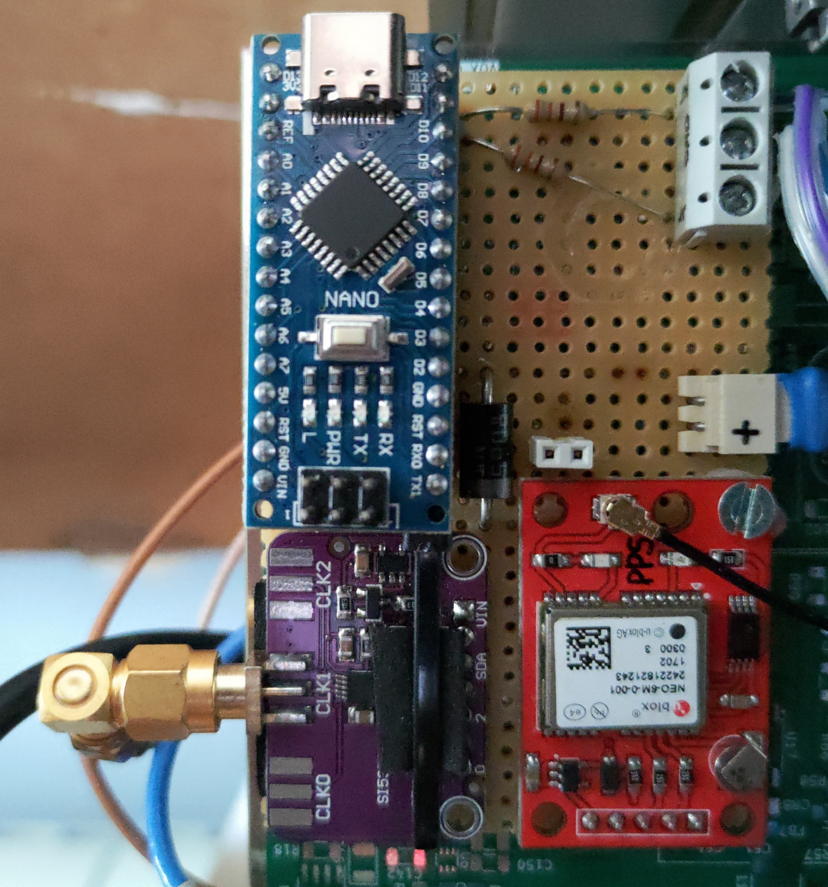
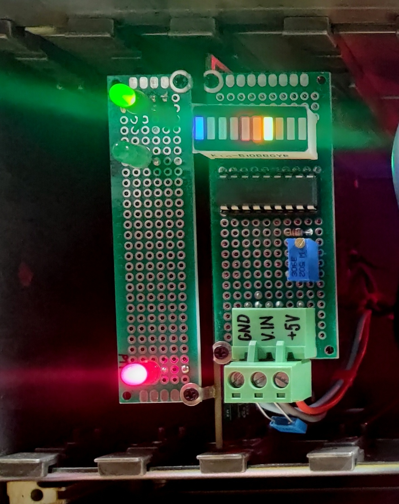

### qo100-pluto-heavy-duty-gs
# Hello fellow QO-100 aficionados,
Here's another realization of a ground station based on <a href="https://wiki.analog.com/university/tools/pluto/hacking/hardware#revision_b" target="_blank">Pluto</a>. Designed as a sturdy box to be thrown on your roof requires just a single Ethernet cable to talk to. It hosts the great <a href="https://github.com/F1ATB/Remote-SDR" target="_blank">F1ATB Remote-SDR</a> web-based transceiver but when roaming in your LAN you can also enjoy the <a href="https://www.sdr-radio.com/console" target="_blank">G4ELI SDR Console</a> desktop application. Pluto is running on a customized firmware from <a href="https://www.f5uii.net/wp-content/uploads/2021/03/pluto.zip" target="_blank">F5UII</a>. Assemblage of assorted open-source candies makes for a comfortable phone operation.

Features:
- operation via a web browser incl. full duplex and live waterfall display
- direct network access to Pluto for 3rd party applications
- push-to-talk automation
- frequency stability from GPS Disciplined Oscillator
- power from PoE only

:warning:Remote operation possible after meeting <a href="https://forum.amsat-dl.org/index.php?thread/3234-remote-operation-via-qo-100/" target="_blank">AMSAT requirements</a>. For the on-demand immediate shutdown capability I'm using a Wi-Fi plug to cut off AC from the PoE injector.

| deployment example               | inside the box |
|----------------------------------|----------|
|  |  |

# Operation
1. Connect to a router with DHCP server via 802.3bt PoE injector offering 90W. 15 meters of SSTP CAT6 works fine. The Raspberry host will be reachable under hostname `remsdr-rpi4`. Configure remote access (eg port forwarding or <a href="https://www.zerotier.com" target="_blank">ZeroTier VPN</a> - installed)
2. Configure the web access <a href="https://remsdr-rpi4/settings.html"  target="_blank">https://remsdr-rpi4/settings.html</a> as described in <a href="https://f1atb.fr/remote-sdr-v5-raspberry-4b-or-orange-pi-image-installation/" target="_blank">https://f1atb.fr/remote-sdr-v5-raspberry-4b-or-orange-pi-image-installation</a>. Finally, navigate to the start page <a href="https://remsdr-rpi4" target="_blank">https://remsdr-rpi4</a>.
3. Alternatively, connect to Pluto locally by specifying `ip:remsdr-rpi4` as an address. Parallel use with the web interface mostly won't work.\
 For SDR Console follow the <a href="https://www.sdr-radio.com/EsHail-2" target="_blank">configuration manual</a>. Connect the USB push-to-talk button and volume knob for best experience.
 
| Arduino Due MIDI controller      |
|----------------------------------|
|  |

:warning: Smooth remote work when talking directly to Pluto (eg. SDR Console) requires a low-jitter 20Mbps connection to stream the whole 500kHz NB transponder. Web interface will settle for an ordinary 512kbps link.

# Troubleshooting
1. Restart Pluto via web interface
2. Try turning it off and on again using your remote AC switch
3. Check GPS status on the dashboard panel inside the box
4. Log in via SSH to conduct further diagnosis

# Service manual
## Pluto SDR
Built on top of rev. 'B' with two modules added inside the enclosure: external clock input and PTT output. Flashed with a firmware from F5UII https://www.f5uii.net/wp-content/uploads/2021/03/pluto.zip, here used only for the PTT when working with SDR Console. PTT is active when GPO0 is high and GPO1 is low to avoid transients on Pluto boot (read more here https://hf5l.pl/adalm-pluto-do-qo100-i-nie-tylko/). Here's ready module employing an 817 optocoupler: . \
Schematics diagram: [pluto_ptt.pdf](hw-pluto-ptt/pluto_ptt.pdf)

External clock feed for Pluto is designed by DM5RM https://forum.amsat-dl.org/index.php?thread/3199-external-clock-for-adalm-pluto/. Operation hinges on a clever idea of creating small DC component from the clock signal for switching inputs between internal oscillator (not very stable for transmitting) and external one. I've added a blue LED informing that the external clock is active. External clock is generated by GPSDO. There's an extra capacitor before the isolating transformer as the GPSDO's Si5351 output stage doesn't like DC shorts.

Schematics diagram: [pluto_clock_buffer-sch.pdf](hw-pluto-ext-clock/pluto_clock_buffer-sch.pdf)

## Raspberry Pi 4B
The platform is running the image from F1ATB https://f1atb.fr/remote-sdr-v5-raspberry-4b-or-orange-pi-image-installation/ and is serving a web-based Remote SDR application for receiving and transmitting via Pluto. In addition, Pluto's libiio endpoint is exposed externally so that you can connect to it via SDR Console or other client. One GPIO pin is the PTT output and connects to the control board. \
Schematics diagram: [main.pdf](hw-block-diagrams/main.pdf) \
Network script for exposing Pluto over RPi's ethernet interface: [ext-pluto](scripts/ext-pluto). Copy it under _/etc/network/interfaces_.

## Power and PTT control
Power supply is provided from a power regulator of the PoE splitter, preset to 24V and rated at 90W max. It goes directly to
- the 2.4GHz power amplifier
- bias-tee and LNA power regulator
- 5V 8A regulator for all other modules

Each downstram line is protected by a resettable polymer fuse. \
Schematics diagram: [pluto_pwr_ctrl.pdf](hw-psu-ctrl/pluto_pwr_ctrl.pdf) 

| 5V regulator close-up                           |
|-------------------------------------------------|
|  |

On the same board is also mounted the PTT circuitry that sums both PTT inputs (from RPi GPIO and Pluto PTT) and switches on PTT voltage for PA (abt. 100mA current consumption).

## GPSDO
Based on projects of W3PM (http://www.knology.net/~gmarcus/), SQ1GU (http://sq1gu.tobis.com.pl/pl/syntezery-dds/44-generator-si5351a) and SP3VSS (https://sp3vss.eu/moje-konstrukcje/gpsdo-generator-synchronizowany-gps/).
It generates fixed 40MHz frequency 40MHz stabilized by the GPS PPS signal and consists of three common-off-the-shelf modules: Arduino Nano (clone), Si5351 synthesiser and a GPS.
This is a minimal implementation of the oscillator, without display and buttons. I have introduced the following changes to the source code:
- removed handling of display and buttons
- added initial frequency correction (about 4kHz) so that at least one synchronization round can be saved. Value is hardcoded and based on a coarse one-time measurement.
- added a duplicated PPS output via GPIO for diagnostics which drives a LED at 0,5Hz and 50% duty.
- code refactoring and clean-up

Sketch: [gpsdo_minimal.ino](hw-gpsdo/gpsdo_minimal.ino) \
Block diagram: [gpsdo.pdf](hw-gpsdo/gpsdo.pdf) \
 \
Output spectrum: 
The spectrum shows a decent pattern for square wave harmonics, however 2nd order components are relatively high and decay to -50dBc at 1GHz. Notable are numerous spikes spaced at 200kHz, most probably being a residue from the internal Si5351 PLL stage. I haven't noticed any audible difference between this GPSDO and internal Pluto clock when working on the narrowband transponder. Wideband use might require a cleaner signal with respect to the jitter but I haven't checked that.

The diagnostics board houses two LEDs showing status of the GPSDO:
- pulse-per-second indicator showing the GPS receiver has signal
- high-accuracy (<1Hz) achieved

In addition:
- red LED when TX is engaged
- bargraph for TX output level

## Transmit button and volume knob
SDR Console application accepts MIDI-based devices to control transceiver functions. A simple implementation for PTT and volume knob can be realized using an Arduino module with USB device native support. I've used a clone _Due R3 SAM3X8E CORTEX-M3_. 
I based on the project presented here: https://go.musiconerd.com/code-gen-basic \
Sketch: [midi_controller_Duo_v2.ino](sw-midi-ctrl%2Fmidi_controller_Duo_v2/midi_controller_Duo_v2.ino)
