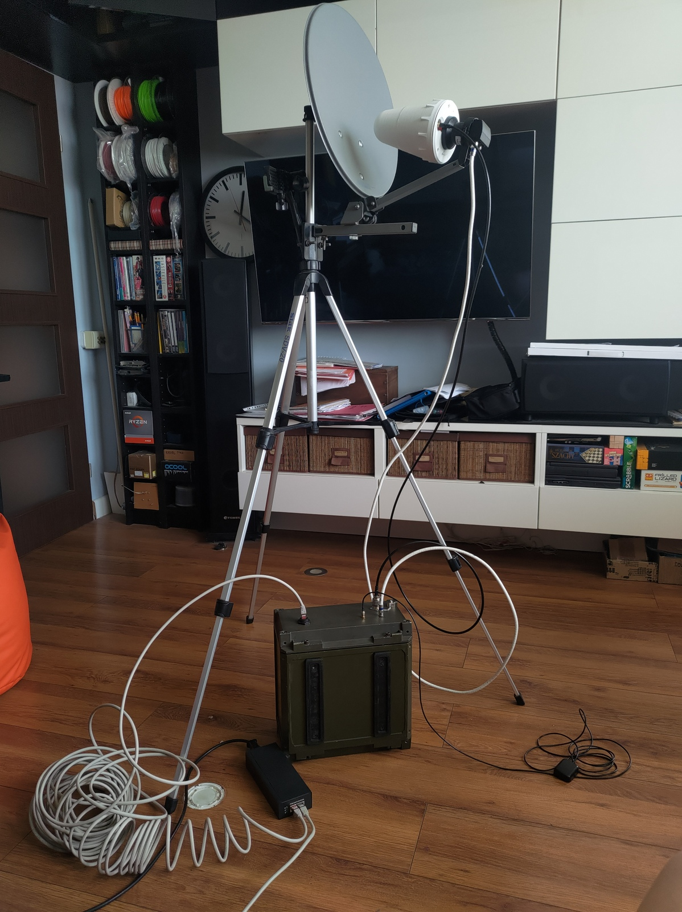
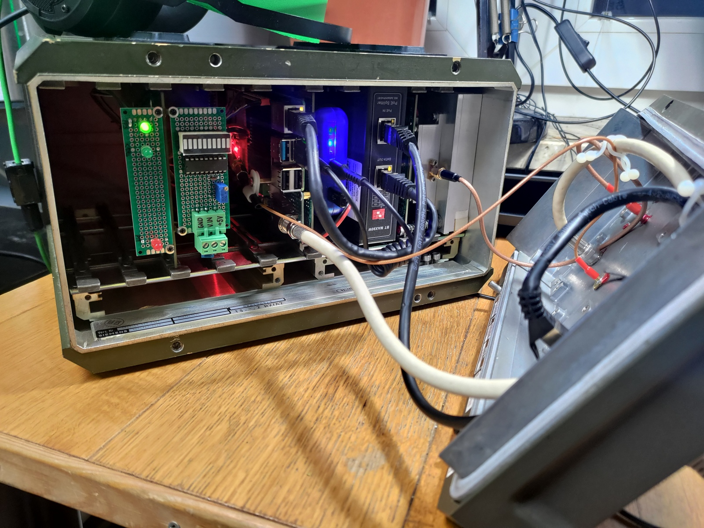
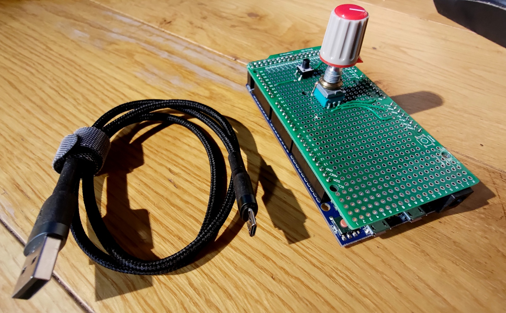

### qo100-pluto-heavy-duty-gs
# Hello fellow QO-100 aficionados,

Here's another realization of a ground station based on <a href="https://wiki.analog.com/university/tools/pluto/hacking/hardware#revision_b" target="_blank">Pluto</a>. Designed as a sturdy box to be thrown on your roof requires just a single Ethernet cable to talk to. It hosts the great <a href="https://github.com/F1ATB/Remote-SDR" target="_blank">F1ATB Remote-SDR</a> web-based transceiver but when roaming in your LAN you can also enjoy the <a href="https://www.sdr-radio.com/console" target="_blank">G4ELI SDR Console</a> desktop application. Pluto is running on a customized firmware from <a href="https://www.f5uii.net/wp-content/uploads/2021/03/pluto.zip" target="_blank">F5UII</a>. Assemblage of assorted open-source candies makes for a comfortable phone operation.

Features:
- operation via a web browser incl. full duplex and live waterfall display
- direct network access to Pluto for 3rd party applications
- push-to-talk automation
- frequency stability from GPS Disciplined Oscillator
- power from PoE only

:warning:Remote operation possible after meeting <a href="https://forum.amsat-dl.org/index.php?thread/3234-remote-operation-via-qo-100/" target="_blank">AMSAT requirements</a>. For the on-demand immediate shutdown capability I'm using a Wi-Fi plug to cut off AC from the PoE injector.

| deployment example               | inside the box |
|----------------------------------|----------|
|  |  |

# Operation

1. Connect to a router with DHCP server via 802.3bt PoE injector offering 90W. 15 meters of SSTP CAT6 works fine. The Raspberry host will be reachable under hostname `remsdr-rpi4`. Configure remote access (port forwarding or <a href="https://www.zerotier.com" target="_blank">ZeroTier VPN</a> - installed)
2. Configure the web access <a href="https://remsdr-rpi4/settings.html"  target="_blank">https://remsdr-rpi4/settings.html</a> as described in <a href="https://f1atb.fr/remote-sdr-v5-raspberry-4b-or-orange-pi-image-installation/" target="_blank">https://f1atb.fr/remote-sdr-v5-raspberry-4b-or-orange-pi-image-installation</a>. Finally, navigate to the start page <a href="https://remsdr-rpi4" target="_blank">https://remsdr-rpi4</a>.
3. Alternatively, connect to Pluto locally by specifying `ip:remsdr-rpi4` as an address. Parallel use with the web interface mostly won't work.\
 For SDR Console follow the <a href="https://www.sdr-radio.com/EsHail-2" target="_blank">configuration manual</a>. Via USB connect the PTT button and volume knob for best experience.
 
| Arduino Due MIDI controller      |
|----------------------------------|
|  |

:warning: Smooth remote work when talking directly to Pluto (eg. SDR Console) requires a low-jitter connection and bandwidth to stream the whole NB transponder - roughly 576k samples. Web interface will settle for an ordinary 1Mbps link.

# Troubleshooting

1. Restart Pluto if XX available
2. Try turning it off and on again using your remote AC switch.
3. Check GPS status on the dashboard panel inside the box.
4. Log in via SSH to conduct further diagnosis.

# Service Manual

