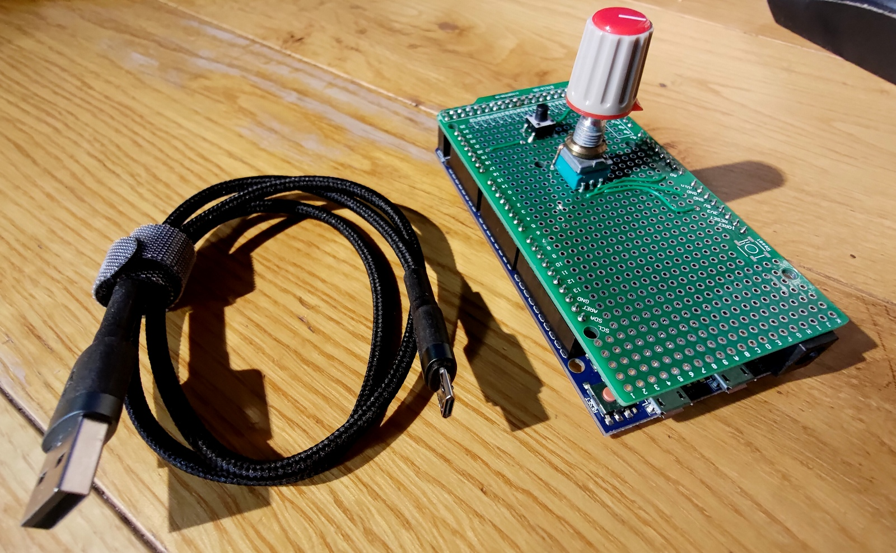
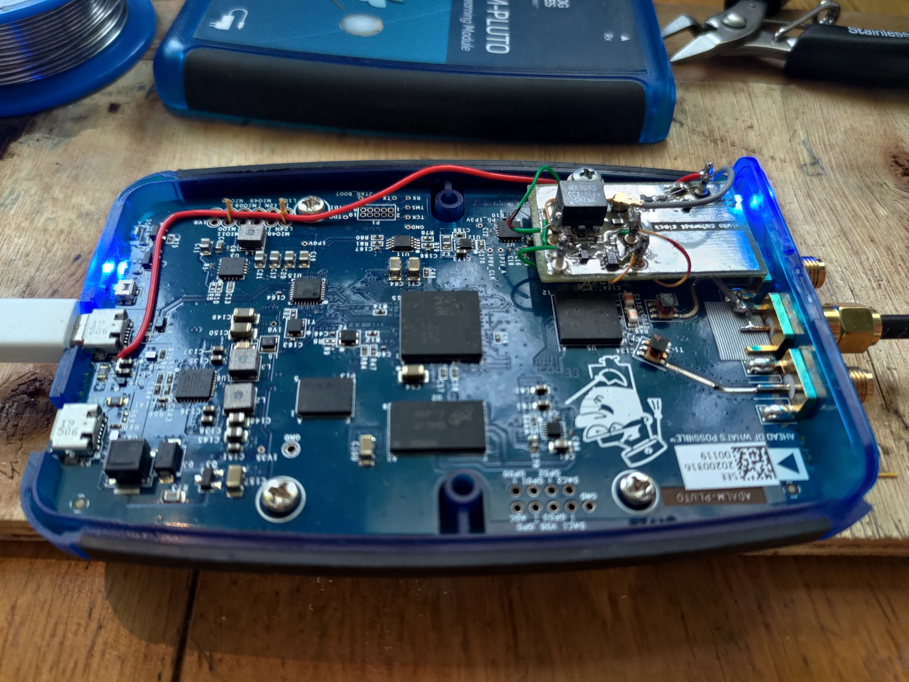
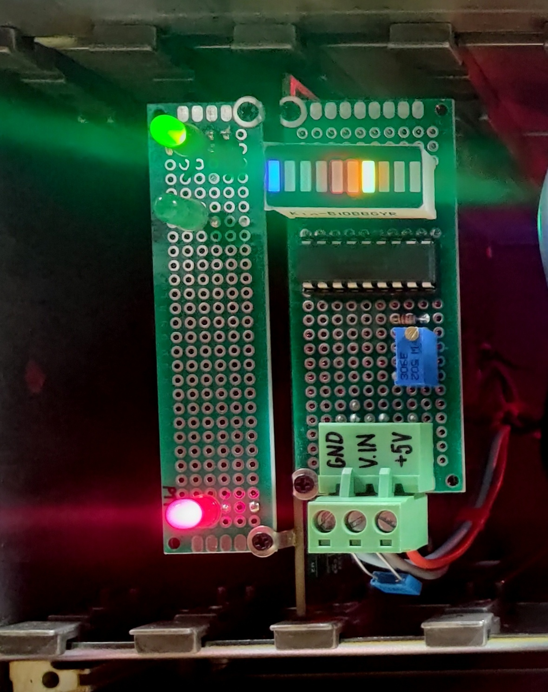

### qo100-pluto-heavy-duty-gs
[](README.md)
[](README.pl.md)

# Stacja bazowa QO-100 na bazie Pluto

<div style="page-break-after: always;"></div>

## Witaj miłośniku łączności satelitarnych przez QO-100,
Oto kolejna realizacja stacji QO-100 na bazie <a href="https://wiki.analog.com/university/tools/pluto/hacking/hardware#revision_b" target="_blank">Pluto</a>. Zaprojektowana jako hermetyczne pudełko które możesz położyć na dachu i podłączyć jednym kablem Ethernet. Obsługa poprzez www: <a href="https://github.com/F1ATB/Remote-SDR" target="_blank">F1ATB Remote-SDR</a> a także, będąc w lokalnej sieci, bezpośrednio przez aplikację desktopową <a href="https://www.sdr-radio.com/console" target="_blank">G4ELI SDR Console</a>. Pluto działa na alternatywnym firmwared od <a href="https://www.f5uii.net/wp-content/uploads/2021/03/pluto.zip" target="_blank">F5UII</a>. Dodatkowe moduły automatyki i stabilizacji częstotliwości zagwarantują wygodną pracę foniczną. \
Spisze się też jako urządzenie przenośne jeśli zapewnisz zasilanie PoE. \
Znajdziesz tu podsumowanie modyfikacji sprzętowych i firmware Pluto które zebrałem z wielu miejsc.

Urządzenie posiada cztery gniazda:
- **RJ-45**: Ethernet+PoE w wersji wodoszczelnej
- **N**: wyście nadajnika 2.4GHz
- **F**: wejście z LNB, należy użyć wtyczki z uszczelką o-ring
- **SMA**: aktywna antena GPS, połączenie wymaga dodatkowego zabezpieczenia przed wilgocią i wodą lub użycie gniazda **F** lub **N**.

| wygląd ogólny                    | wnętrze                            |
|----------------------------------|------------------------------------|
|  |  |

## Cechy:
- obsługa poprzez przeglądarkę internetową w tym pełny dupleks i wodospad
- bezpośredni dostęp do Pluto dla innych aplikacji np. SDR Console
- automatyczna obsługa PTT
- stabilność częstotliwości gwarantowana przez GPSDO
- zasilanie wyłącznie z PoE

## Gdzie się sprawdzi?
- jeśli z powodów np. bezpieczeństwa nie możemy pozwolić sobie na doprowadzenie zasilania sieciowego
- mamy ograniczone możliwości okablowania - wystarczy jest jeden kabel sieciowy do sterowania i zasilania. Urządzenie najsensowniej umieścić jest blisko czaszy satelitarnej, wraz z anteną GPS aby w szczególności zminimalizować straty w nadawaniu. 
- praca w warunkach atmosferycznych
- gdy po prostu chcemy mieć stację QO-100 i korzystać z niej gdy jesteśmy poza domem
- jeśli planujemy rozbudowę o pracę all-mode w pasmach amatorskich w zakresie do 70MHz do 6GHz aby wykorzystać pełen potencjał Pluto. W obudowie jest wolna przestrzeń ok. 28 x 13 x 11cm w której zmieści się przekaźnik TX/RX, filtry oraz wzmacniacz mocy. Rozważ zamontowanie osobnego gniazda antenowego na inne pasma aby uniknąć przełączania TX 2.4GHz. Limitem będzie też dostępna moc zasilania 90W. W urządzeniu jest zapas mocy wystarczający na zainstalowanie wzmacniacza 2.4GHz 20W z którym, wraz z anteną 120cm możemy pokusić się o próby z DATV (czego do tej pory nie testowałem).

:warning: Do pracy zdalnej należy spełnić <a href="https://forum.amsat-dl.org/index.php?thread/3234-remote-operation-via-qo-100/" target="_blank">wymagania AMSAT</a>. Tylko Ty możesz jej używać, nie wolno udostępniać innym. Do awaryjnego wyłączania używam gniazdka sterowanego przez Wi-Fi i aplikacji w telefonie, odcina ono zasilanie do inżektora PoE.

## Komponenty zestawu:
- zasilacz PoE, użyłem zasilacza sieciowego PoE 90W 230V z Chin
- właściwe urządzenie

Z anteną offsetową 85cm i oświetlaczem POTY testy łączności pokazały że można przebić się w miarę szybko w pile-upach. Urządzenie należy umieścić jak najbliżej anteny aby zminimalizować straty w sygnale nadawanym. Przy pracy portable ciężar urządzenia można też wykorzystać jako stabilizację anteny zamontowanej na statywie.

### Gniazdo RJ-45

Użyte gniazdo sieciowe powinno gwarantować wodoodporność. Poniżej przedstawione są szczegóły użytego  półprofesjonalnego gniazda (cena 80zł). W pełni profesjonalne, certyfikowane będzie wiązało się z kosztem kilkukrotnie większym. \
Widoczna jest dławnica kablowa kompresyjnie zaciskająca przewód oraz uszczelka.

|                |                  |                               |
|----------------|------------------|-------------------------------|
|  |  |  |

## Aktualny stan prac
Urządzenie testowane jest od lipca 2024 na balkonie pod otwartym niebem. Celem jest zweryfikowanie stabilności pracy oraz odporności na wilgoć i wodę. Aktualnie testuję projekt plastikowej nakładki na front urządzenia która ma za zadanie zapewnić większą odporność na te czynniki.

# Obsługa
1. Podłącz urządzenie do routera z serwerem DHCP poprzez inżektor PoE 802.3bt o wydajności 90W. 15 metrowy kabel SSTP CAT6 działa w porządku. Host Raspberry będzie osiągalnu pod nazwą `remsdr-rpi4`. Skonfiguruj zdalny dostęp według potrzeb (np. port forwarding lub <a href="https://www.zerotier.com" target="_blank">ZeroTier VPN</a> którego również zainstalowałem)
2. Skonfiguruj dostęp przez www <a href="https://remsdr-rpi4/settings.html"  target="_blank">https://remsdr-rpi4/settings.html</a> według opisu <a href="https://f1atb.fr/remote-sdr-v5-raspberry-4b-or-orange-pi-image-installation/" target="_blank">https://f1atb.fr/remote-sdr-v5-raspberry-4b-or-orange-pi-image-installation</a>. Następnie wejdź na stronę startową <a href="https://remsdr-rpi4" target="_blank">https://remsdr-rpi4</a>.
3. Możesz także podłączyć się bezpośrednio do Pluto z wybranej aplikacji obsługującej tego SDRa, należy ustawić jego adres jako `ip:remsdr-rpi4`. Równoczesna praca z aplikacją www nie jest gwarantowana. \
 Dla aplikacji SDR Console zapoznaj się z <a href="https://www.sdr-radio.com/EsHail-2" target="_blank">poradnikiem konfiguracji</a>. Podłącz manipulator PTT i gałkę głośności (osobny kontroler MIDI USB) dla większej wygody użytkowania.
 
| kontroler MIDI na Arduino Due |
|-------------------------------|
|  |

:warning: Płynna praca zdalna w trybie bezpośredniego połączenia do Pluto (np. SDR Console) wymaga stabilnego łącza o przepustowości 20Mbps ponieważ przesyłane są dane z całego transpondera NB (500kHz). Natomiast praca przez aplikację www zadowoli się zwykłym łączem 512kbps.

# Rozwiązywanie problemów
1. Zrestartuj Pluto uzywając przycisku w aplikacji www
2. Wyłącz i włącz ponownie całe urządzenie odłączając na chwilę zasilanie
3. Sprawdź stan generatora GPSDO na panelu diagnostycznym czy aktywny jest sygnal PPS
4. Zaloguj się do RPi przez SSH aby wykonać dalszą diagnostykę

# Instrukcja serwisowa
Schemat blokowy: [main.pdf](hw-block-diagrams/main.pdf)

## Pluto SDR
Bazą jest wersja 'B' do której dodałem dwa moduły do środka obudowy Pluto: wejście zewnętrznego zegara i wyjście PTT. Firmware pochodzi od F5UII https://www.f5uii.net/wp-content/uploads/2021/03/pluto.zip, tu wykorzystane tylko do automatyzacji PTT. 

### PTT
Wyjście aktywuje się gdy GPO0 jest w stanie wysokim a GPO1 niskim, ma to na celu ochronę przed stanami nieustalonymi przy starcie (tu przeczytasz więcej: https://hf5l.pl/adalm-pluto-do-qo100-i-nie-tylko/). Oto gotowy moduł z transoptorem 817 zamiast przekaźnika:


Schemat ideowy: [pluto_ptt.pdf](hw-pluto-ptt/pluto_ptt.pdf) 

Do zainstalowania tego rozszerzenia wywierć otwór ok. 5mm w plastikowej ściance z gniazdami i zamontuj smukłe gniazdo Cinch. Przykręć płytkę do istniejącego otworu mocującego płytę główną dodając plastikowy dystans 5mm.

### Zewnętrzny zegar
Motywacją do tej poprawki jest nieakceptowalna stabilność wbudowanego oscylatora Pluto rev 'B' przy pracy fonicznej. Korekcja częstotliwości według beacona (realizowana zarówno w SDR Console oraz Remote SDR) zapewnia stabilny odbiór, usuwa ona dryf częstotliwości pochodzący z LNB oraz Pluto. To jednak nie zapewni stabilności częstotliwości nadawania.

Moduł zewnętrznego zegara bezuje na designie DM5RM https://forum.amsat-dl.org/index.php?thread/3199-external-clock-for-adalm-pluto/. Zawiera on separację galwaniczną, detektor zewnętrznego zegara, bufor oraz sterowanie wbudowanym oscylatorem Pluto. Dodałem niebieską diodę LED wskazującą aktywne wejście zewnętrzne. 

 \

 \

Schemat ideowy: [pluto_clock_buffer-sch.pdf](hw-pluto-ext-clock/pluto_clock_buffer-sch.pdf) \
Do zainstalowania tego rozszerzenia wywierć otwór 6mm między gniazdami RX i TX Pluto. Na płytę główną wciśnij złącze krawędziowe SMA przedtem izolując miejsce taśmą izolacyjną aby zapobiec złączeniu się mas gniazda SMA oraz Pluto. Krótkim odcinkiem przewodu koncentrycznego połącz gniazdo i płytkę. Przylutuj cztery przewody do istniejącego oscylatora Pluto i podłącz je do modułu. Zamocuj go podobnie jak moduł PTT. Zasilanie podprowadź z USB osobnym kablem lutując go do kondensatora filtrującego jak na rysunku. To napięcie również zasila rozszerzenie PTT.

### Porty RX i TX
Wzmacniacz mocy 2.4GHz dostarcza ok. 10W przy zasilaniu 24V 2A. Zamontowany jest na radiatorze który dodatkowo przyciśnięty jest do obudowy urządzenia. Składa się z filtru SAW, przedwzmacniacza MMIC oraz stopnia mocy i sprzęgacza kierunkowego do pomiaru mocy. Linia PTT wymaga wydajności prądowej ok. 90mA ponieważ nie tylko polaryzuje stopień końcowy ale też zasila MMIC-a. \


Ścieżka odbiorcza składa się z typowego LNB oraz bias-tee który wydziela sygnał p.cz. 738MHz i podaje go bezpośrednio na port RX Pluto. Dodałem opcję przełączania napięcia LNA dla kontroli polaryzacji H/V dla przyszłych eksperymentów z odbiorem DATV. \

 \
Schemat ideowy: [pluto_biastee.pdf](hw-biastee-lna/pluto_biastee.pdf)

## Raspberry Pi 4B
Mikrokomputer ten działa na obrazie  https://f1atb.fr/remote-sdr-v5-raspberry-4b-or-orange-pi-image-installation/ który zawiera aplikację Remote SDR autorstwa F1ATB pozwalającą na odbiór i nadawanie poprzez stronę www. Jeden pin GPIO wyprowadzony jest do modułu sterującego PTT. \
W trybie bezpośredniego dostępu, endpoint libiio Pluto wystawiony jest na zewnątrz umożliwiając podłączenie się przez SDR Console lub inną ulubioną aplikację. Niezbędne jest zainstalowanie skryptu aplikującego reguły sieciowe: [ext-pluto](scripts/ext-pluto). Skopiuj go do ```/lib/dhcpcd/dhcpcd-hooks``` pod nazwą taką, aby uruchomił się na końcu biorąc pod uwagę pozostałe skrypty w tym katalogu; w moim przypadku była to ```69-ext-pluto.conf```.

W przypadku problemów (Pluto nie jest osiągalne przez interfejs RPi) sprawdź logi z tego skryptu pod ```/var/tmp/pluto-network-config.txt```.

Wyłącz Wi-Fi oraz BT używając narzędzia *rfkill*. Konfiguracja przechowywana jest między restartami.
```bash
pi@remsdr-rpi4:~ $ rfkill block 0 1
pi@remsdr-rpi4:~ $ rfkill list
0: phy0: Wireless LAN
        Soft blocked: yes
        Hard blocked: no
1: hci0: Bluetooth
        Soft blocked: yes
        Hard blocked: no
```

## Zasilanie i sterowanie PTT
Źródłem zasilania jest przetwornica w splitterze PoE, ustawiona na 24V i mająca wydaność 90W. Napięcie to zasila:
- wzmacniacz mocy 2.4GHz
- bias-tee dla LNA wraz ze stabilizatorem 13/17V
- przetwornicę 5V 8A dla wszystkich pozostałych modułów

Każda linia zabezpieczona jest bezpiecznikiem polimerowym. \
Schemat blokowy: [pluto_pwr_ctrl.pdf](hw-psu-ctrl/pluto_pwr_ctrl.pdf)

Przetwornica 5V 8A firmy Polou\


Na tej płytce zamontowane jest również sterowanie nadajnikiem które sumuje obydwa wejścia PTT (z RPi GPIO0 oraz Pluta PTT) oraz załącza napięcie PTT dla wzmacniacza mocy.

## Generator GPSDO
Bazowałem na projektach: W3PM (https://github.com/W3PM/GPS-Si5351-VFO-QEX-JUL-AUG-2015), SQ1GU (http://sq1gu.tobis.com.pl/pl/syntezery-dds/44-generator-si5351a) oraz SP3VSS (https://sp3vss.eu/moje-konstrukcje/gpsdo-generator-synchronizowany-gps/).
Generuje on ustaloną częstotliwość 40MHz stabilizowaną według impulsu PPS z GPS. Składa się z popularnych modułów: Arduino Nano (klon), syntezer Si5351 oraz odbiornik GPS uBlox Neo6. Jest to minimalna implementacja sprzętowa, bez wyświetlacza i przycisków. Wprowadziłem kilka zmian do kodu:
- usunąłem osbługę nieużywanych peryferiów
- dodałem wstępną korektę częstotliwości (ok. 4kHz) która przyśpiesza uzyskanie stabilizacji. Wartość tę zmierzyłem zgrubnie i umieściłem w kodzie
- sterowanie diodą LED PPS aby migała zmieniając stan co sekundę dla łatwej obserwacji
- refaktoring kodu

Wybrałem powyższe rozwiązanie ze względu na cenę, bezwzględną stabilność częstotliwości (niewymagającą ustawienia lub zmierzenia przed instalacją) oraz otwarty kod źródłowy.

### Zagadnienia stabilności
Algorytm GPSDO dokonuje korekty odchyłu co 44s bazując na zliczaniu impulsów bramkowanych przez sygnał PPS z preskalera. Oscylator Si5351 posiada źródło odniesienia będące zwykłym rezonatorem kwarcowym. Między korektami może pojawiać się 'pływanie', które jak sprawdziłem przestaje być odczuwalne po kilku minutach (rundach korekty). Dodałem izolację termiczną na ten rezonator w postaci kawałka plastikowej pianki. Sama obudowa zdaje się już zapewniać dobrą bezwładność termiczną.

#### Możliwe modyfikacje
- użycie gotowego generatora TCXO. Należy wprowadzić poprawkę do konfiguracji Pluto po zmierzeniu częstotliwości (procedura opisana w dokumentacji SDR Console). Dodatkowo, odpadnie potrzeba gniazda SMA do antenty GPS.
:warning: należy zastosować generator pracujący w zakresie specyfikowanym dla układu AD9363 (10-80MHz). Przy zegarze 10MHz Pluto może czasem nie wystartować. Producent użył wartości 40MHz :warning:
- użycie fabrycznego GPSDO renomowanych firm np. Trimble. Używane moduły dostępne są w cenie ok. 600zł. Posiadają one bazowy oscylator OCXO, często podwójny oraz bardziej zaawansowane algorytmy korekcji które niwelują stabilność krótkookresową. Pobierają też więcej prądu szczególnie podczas podgrzewania OCXO co należy uwzględnić w bilansie mocy.
- zamontowanie prostego termostatu na kwarcu Si5351
- własna implementacja pętli stabilizacji z częstszym korygowaniem odchyłki

Listing: [gpsdo_minimal.ino](hw-gpsdo/gpsdo_minimal.ino) \
Schemat blokowy: [gpsdo.pdf](hw-gpsdo/gpsdo.pdf) \
 \
Widmo: 
Spektrum pokazuje oczekiwane składowe sygnału prostokątnego oraz niewielką zawartośc parzystych harmonicznych. Liczne prążki w dolnej części widma pochodzą prawdopodobnie z bloku PLL syntezera Si5351, mają jednak dość małą amplitudę. Nie zauważyłem słyszalnych różnic między tym a generowanym wewnętrznie sygnałem zegarowym.

Moduł diagnostyczny zawiera dwie zielone diody LED informujące o stanie pracy generatora GPSDO:
- sygnał PPS, pulsowanie co 1 sekundę. Oznacza, że odbiornik zaczął odbierać sygnał z satelit; pomaga w wybraniu lokalizacji anteny odbiorczej GPS.
- osiągnięta wysoka dokładność stabilizacji (<1Hz), może pojawić się po kilku minutach. Typowo odchyłka osiąga 2..3Hz.

Dodatkowo diagnostyka pokazuje:
- załączony nadajnik: czerwona dioda LED
- kolorowy bargraph: poziom mocy wyjściowej.



## Przycisk PTT oraz regulacja głośności
SDR Console pozwala skonfigurować kontroler MIDI do sterowania różnymi funkcjami, np. PTT, przestrajanie, regulacja głośności i wiele innych. Najprościej zrealizować to używając modułu Arduino wspierającego natywnie urządzenie USB. Użyłem klona _Due R3 SAM3X8E CORTEX-M3_ i bazowałem na projekcie https://go.musiconerd.com/code-gen-basic. Mikroprzełącznik załącza i wyłącza nadajnik i podłączony jest pod wybrany GPIO. Potencjometr 47k podłączony jest pod wejście ADC oraz linie zasilania 5V i GND. Konfiguracja jest trywialna i sprowadza się do wciśnięcia przycisku lub poruszenia potencjometrem aby aplikacja zarejestrowała tzw. kanał i przypisania go: https://www.sdr-radio.com/midi-controllers. \
Listing: [midi_controller_Duo_v2.ino](sw-midi-ctrl/midi_controller_Duo_v2/midi_controller_Duo_v2.ino)

# Kosztorys
[kosztorys](bom.html)