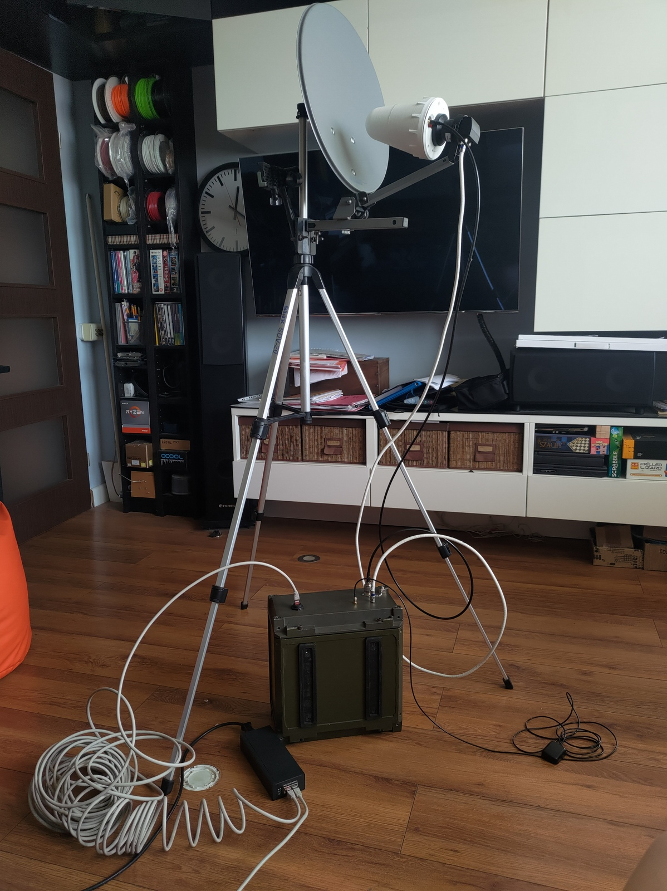
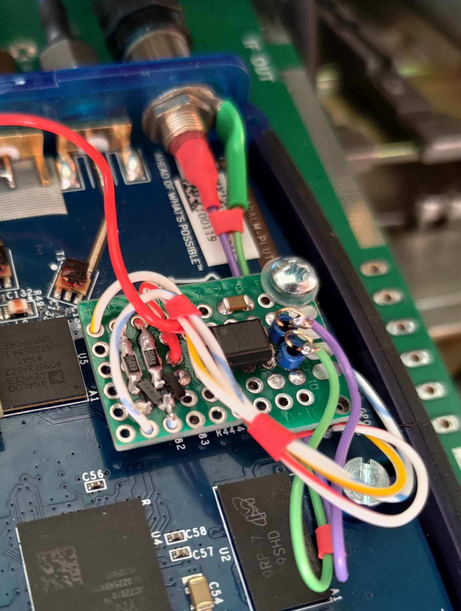
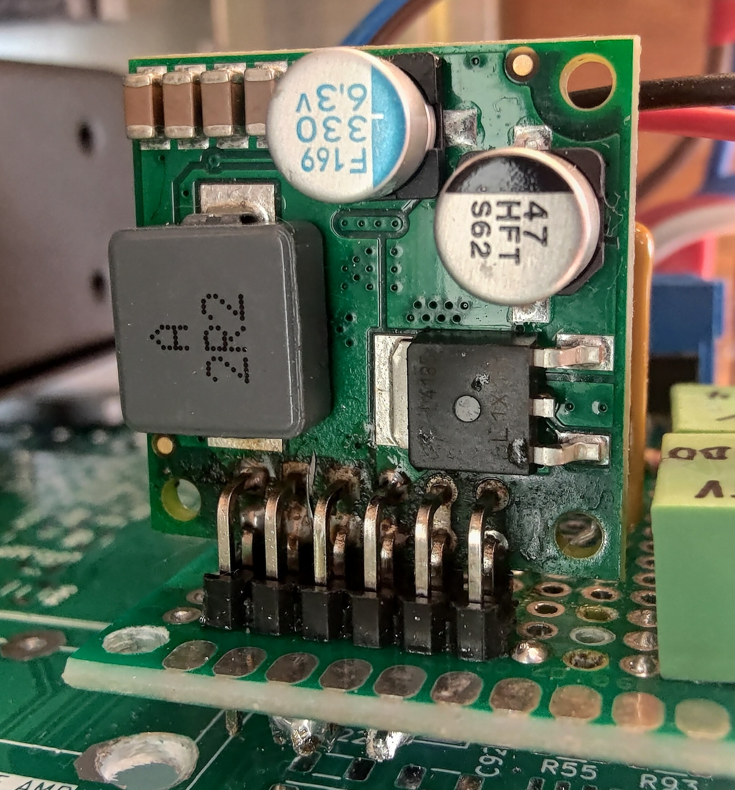
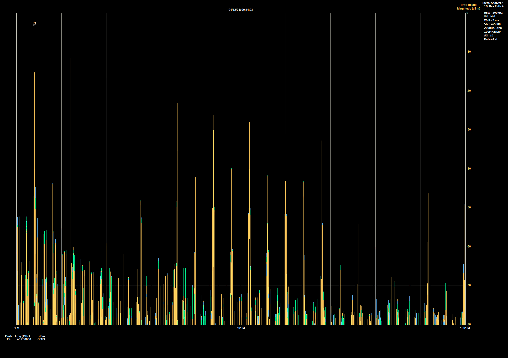

### qo100-pluto-heavy-duty-gs

# Witaj miłośniku łączności satelitarnych przez QO-100,
Oto kolejna realizacja stacji QO-100 na bazie <a href="https://wiki.analog.com/university/tools/pluto/hacking/hardware#revision_b" target="_blank">Pluto</a>. Zaprojektowana jako hermetyczne pudełko które możesz położyć na dachu i podłączyć jednym kablem Ethernet. Obsługa poprzez www: <a href="https://github.com/F1ATB/Remote-SDR" target="_blank">F1ATB Remote-SDR</a> a także, będąc w lokalnej sieci, bezpośrednio przez aplikację desktopową <a href="https://www.sdr-radio.com/console" target="_blank">G4ELI SDR Console</a>. Pluto działa na alternatywnym firmwared od <a href="https://www.f5uii.net/wp-content/uploads/2021/03/pluto.zip" target="_blank">F5UII</a>. Dodatkowe moduły automatyki i stabilizacji częstotliwości gwarantują wygodną pracę foniczną.

Urządzenie posiada cztery hermetyczne gniazda:
- **RJ-45**: Ethernet+PoE
- **N**: wyście nadajnika 2.4GHz
- **F**: wejście z LNB
- **SMA**: aktywna antena GPS

Cechy:
- obsługa poprzez przeglądarkę internetową w tym pełny dupleks i wodospad
- bezpośredni dostęp do Pluto dla innych aplikacji np. SDR Console
- automatyczna obsługa PTT
- stabilność częstotliwości gwarantowana przez GPSDO
- zasilanie wyłącznie z PoE

:warning: Do pracy zdalnej należy spełnić <a href="https://forum.amsat-dl.org/index.php?thread/3234-remote-operation-via-qo-100/" target="_blank">wymagania AMSAT</a>. Używam gniazdka sterowanego przez Wi-Fi i aplikację w telefonie, odcina ono zasilanie do inżektora PoE.

| wygląd ogólny                    | wnętrze                            |
|----------------------------------|------------------------------------|
|  |  |

# Obsługa
1. Podłącz urządzenie do routera z serwerem DHCP poprzez inżektor PoE 802.3bt o wydajności 90W. 15 metrowy kabel SSTP CAT6 działa w porządku. Host Raspberry będzie osiągalnu pod nazwą `remsdr-rpi4`. Skonfiguruj zdalny dostęp według potrzeb (np. port forwarding lub <a href="https://www.zerotier.com" target="_blank">ZeroTier VPN</a> którego również zainstalowałem)
2. Skonfiguruj dostęp przez www <a href="https://remsdr-rpi4/settings.html"  target="_blank">https://remsdr-rpi4/settings.html</a> według opisu <a href="https://f1atb.fr/remote-sdr-v5-raspberry-4b-or-orange-pi-image-installation/" target="_blank">https://f1atb.fr/remote-sdr-v5-raspberry-4b-or-orange-pi-image-installation</a>. Następnie wejdź na stronę startową <a href="https://remsdr-rpi4" target="_blank">https://remsdr-rpi4</a>.
3. Możesz także podłączyć się bezpośrednio do Pluto z wybranej aplikacji obsługującej tego SDRa, należy ustawić jego adres jako `ip:remsdr-rpi4`. Równoczesna praca z aplikacją www nie jest gwarantowana. \
 Dla aplikacji SDR Console zapoznaj się z <a href="https://www.sdr-radio.com/EsHail-2" target="_blank">poradnikiem konfiguracji</a>. Podłącz manipulator PTT i gałkę głośności (osobny kontroler MIDI USB) dla większej wygody użytkowania.
 
| kontroler MIDI na Arduino Due            |
|----------------------------------------------------------|
|  |

:warning: Płynna praca zdalna w trybie bezpośredniego połączenia do Pluto (np. SDR Console) wymaga stabilnego łącza o przepustowości 20Mbps ponieważ przesyłane są dane z całego transpondera NB (500kHz). Natomiast praca przez aplikację www zadowoli się zwykłym łączem 512kbps.

# Rozwiązywanie problemów
1. Zrestartuj Pluto uzywając przycisku w aplikacji www
2. Wyłącz i włącz ponownie całe urządzenie odłączając na chwilę zasilanie
3. Sprawdź stan generatora GPSDO na panelu diagnostycznym czy aktywny jest sygnal PPS
4. Zaloguj się do RPi przez SSH aby wykonać dalszą diagnostykę

# Instrukcja serwisowa
Schemat blokowy: [main.pdf](hw-block-diagrams/main.pdf)

## Pluto SDR
Bazą jest wersja 'B' do której dodałem dwa moduły do środka obudowy Pluto: wejście zewnętrznego zegara i wyjście PTT. Firmware pochodzi od F5UII https://www.f5uii.net/wp-content/uploads/2021/03/pluto.zip, tu wykorzystane tylko do automatyzacji PTT. Wyjście aktywuje się gdy GPO0 jest w stanie wysokim a GPO1 niskim, ma to na celu ochronę przed stanami nieustalonymi przy starcie (tu przeczytasz więcej: https://hf5l.pl/adalm-pluto-do-qo100-i-nie-tylko/). Oto gotowy moduł z transoptorem 817 zamiast przekaźnika:  \
Schemat ideowy: [pluto_ptt.pdf](hw-pluto-ptt/pluto_ptt.pdf)

Do zainstalowania tego rozszerzenia wywierć otwór ok. 5mm w plastikowej ściance z gniazdami i zamontuj smukłe gniazdo Cinch. Przykręć płytkę do istniejącego otworu mocującego płytę główną dodając plastikowy dystans 5mm.

Moduł zewnętrznego zegara bezuje na designie DM5RM https://forum.amsat-dl.org/index.php?thread/3199-external-clock-for-adalm-pluto/. Zawiera on separację galwaniczną, detektor zewnętrznego zegara, bufor oraz sterowanie wbudowanym oscylatorem Pluto. Dodałem niebieską diodę LED wskazującą aktywne wejście zewnętrzne.

Schemat ideowy: [pluto_clock_buffer-sch.pdf](hw-pluto-ext-clock/pluto_clock_buffer-sch.pdf) \
Do zainstalowania tego rozszerzenia wywierć otwór 6mm między gniazdami RX i TX Pluto. Na płytę główną wciśnij złącze krawędziowe SMA przedtem izolując miejsce taśmą izolacyjną aby zapobiec złączeniu się mas gniazda SMA oraz Pluto. Krótkim odcinkiem przewodu koncentrycznego połącz gniazdo i płytkę. Przylutuj cztery przewody do istniejącego oscylatora Pluto i podłącz je do modułu. Zamocuj go podobnie jak moduł PTT. Zasilanie podprowadź z USB osobnym kablem lutując go do kondensatora filtrującego jak na rysunku. To napięcie również zasila rozszerzenie PTT.

Wzmacniacz mocy 2.4GHz dostarcza ok. 10W przy zasilaniu 24V 2A. Zamontowany jest na radiatorze który dodatkowo przyciśnięty jest do obudowy urządzenia. Składa się z filtru SAW, przedwzmacniacza MMIC oraz stopnia mocy i sprzęgacza kierunkowego do pomiaru mocy. Linia PTT wymaga wydajności prądowej ok. 90mA ponieważ nie tylko polaryzuje stopień końcowy ale też zasila MMIC-a.

Ścieżka odbiorcza składa się z typowego LNB oraz bias-tee który wydziela sygnał p.cz. 738MHz i podaje go bezpośrednio na port RX Pluto. Dodałem opcję przełączania napięcia LNA dla kontroli polaryzacji H/V dla przyszłych eksperymentów z odbiorem DATV.
 \
Schemat ideowy: [pluto_biastee.pdf](hw-biastee-lna/pluto_biastee.pdf)

## Raspberry Pi 4B
Mikrokomputer ten działa na obrazie  https://f1atb.fr/remote-sdr-v5-raspberry-4b-or-orange-pi-image-installation/ który zawiera aplikację Remote SDR autorstwa F1ATB pozwalającą na odbiór i nadawanie poprzez stronę www. Jeden pin GPIO wyprowadzony jest do modułu sterującego PTT. \
W trybie bezpośredniego dostępu, endpoint libiio Pluto wystawiony jest na zewnątrz umożliwiając podłączenie się przez SDR Console lub inną ulubioną aplikację. Niezbędne jest zainstalowanie skryptu aplikującego reguły sieciowe: [ext-pluto](scripts/ext-pluto). Skopiuj go do _/etc/network/interfaces_.

## Zasilanie i sterowanie PTT
Źródłem zasilania jest przetwornica w splitterze PoE, ustawiona na 24V i mająca wydaność 90W. Napięcie to zasila:
- wzmacniacz mocy 2.4GHz
- bias-tee dla LNA wraz ze stabilizatorem 13/17V
- przetwornicę 5V 8A dla wszystkich pozostałych modułów

Każda linia zabezpieczona jest bezpiecznikiem polimerowym. \
Schemat blokowy: [pluto_pwr_ctrl.pdf](hw-psu-ctrl/pluto_pwr_ctrl.pdf)

| przetwornica 5V                                |
|------------------------------------------------|
|  |

Na tej płytce zamontowane jest również sterowanie nadajnikiem które sumuje obydwa wejścia PTT (z RPi GPIO0 oraz Pluta PTT) oraz załącza napięcie PTT dla wzmacniacza mocy.

## Generator GPSDO
Bazowałem na projektach: W3PM (https://github.com/W3PM/GPS-Si5351-VFO-QEX-JUL-AUG-2015), SQ1GU (http://sq1gu.tobis.com.pl/pl/syntezery-dds/44-generator-si5351a) oraz SP3VSS (https://sp3vss.eu/moje-konstrukcje/gpsdo-generator-synchronizowany-gps/).
Generuje on ustaloną częstotliwość 40MHz stabilizowaną według impulsu PPS z GPS. Składa się z popularnych modułów: Arduino Nano (klon), syntezer Si5351 oraz odbiornik GPS uBlox Neo6. Jest to minimalna implementacja sprzętowa, bez wyświetlacza i przycisków. Wprowadziłem kilka zmian do kodu:
- usunąłem osbługę nieużywanych peryferiów
- dodałem wstępną korektę częstotliwości (ok. 4kHz) która przyśpiesza uzyskanie stabilizacji. Wartość tę zmierzyłem zgrubnie i umieściłem w kodzie
- sterowanie diodą LED PPS aby migała zmieniając stan co sekundę dla łatwej obserwacji
- refaktoring kodu

Listing: [gpsdo_minimal.ino](hw-gpsdo/gpsdo_minimal.ino) \
Schemat blokowy: [gpsdo.pdf](hw-gpsdo/gpsdo.pdf) \
 \
Widmo: 
Spektrum pokazuje oczekiwane składowe sygnału prostokątnego oraz niewielką zawartośc parzystych harmonicznych. Liczne prążki w odstępie 200kHz pochodzą prawdopodobnie z części PLL syntezera Si5351, mają jednak dość małą amplitudę. Nie zauważyłem słyszalnych różnic między tym a generowanym wewnętrznie sygnałem zegarowym.

Moduł diagnostyczny zawiera dwie zielone diody LED informujące o stanie pracy generatora GPSDO:
- sygnał PPS, pulsowanie co 1 sekundę. Oznacza, że odbiornik zaczął odbierać sygnał z satelit; pomaga w wybraniu lokalizacji anteny odbiorczej GPS.
- osiągnięta wysoka dokładność stabilizacji (<1Hz), może pojawić się po kilku minutach. Typowo odchyłka osiąga 2..3Hz.

Dodatkowo diagnostyka pokazuje:
- załączony nadajnik: czerwona dioda LED
- kolorowy bargraph: poziom mocy wyjściowej.
  

## Przycisk PTT oraz regulacja głośności
SDR Console pozwala skonfigurować kontroler MIDI do sterowania różnymi funkcjami, np. PTT, przestrajanie, regulacja głośności i wiele innych. Najprościej zrealizować to używając modułu Arduino wspierającego natywnie urządzenie USB. Użyłem klona _Due R3 SAM3X8E CORTEX-M3_ i bazowałem na projekcie https://go.musiconerd.com/code-gen-basic. Mikroprzełącznik załącza i wyłącza nadajnik i podłączony jest pod wybrany GPIO. Potencjometr 47k podłączony jest pod wejście ADC oraz linie zasilania 5V i GND. Konfiguracja jest trywialna i sprowadza się do wciśnięcia przycisku lub poruszenia potencjometrem aby aplikacja zarejestrowała tzw. kanał i przypisała go: https://www.sdr-radio.com/midi-controllers. \
Listing: [midi_controller_Duo_v2.ino](sw-midi-ctrl/midi_controller_Duo_v2/midi_controller_Duo_v2.ino)
